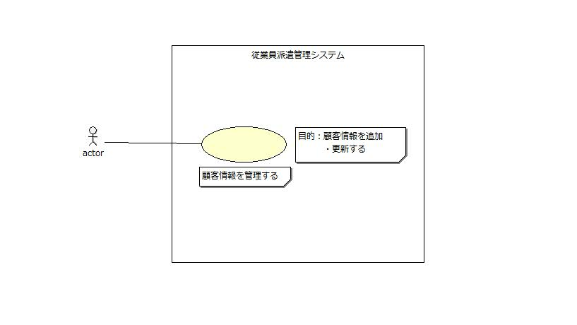

# 顧客情報の管理

## 1.概要
従業員管理システムにおいて顧客情報の追加や更新ができるように
機能の追加・変更を行う

## 2.ユースケース図

## 3.イベントフロー
1. メインフロー
このユースケースは、オペレータが「顧客管理」を選択することから
始まり、選択された機能コードにより、以下の処理に分かれる
	1.「追加」の機能コード(CI)が選択された場合
	オペレータが顧客情報を入力すると、システムがは入力された顧客情報に
	顧客マスタに登録されている最大の顧客IDに1を加えた顧客を割り当てて
	従業員マスタに登録し、割り当てられた顧客IDを画面に表示する
	1. 「更新」のコード(CU)我選択された場合
	オペレータが顧客IDを師弟すると、システムは該当する顧客情報を顧客
	マスタから取り出して表示する。オペレータが更新する項目番号を更新値
	を入力すると、システムは入力された値で顧客マスタを更新する
## 4.シーケンス図
