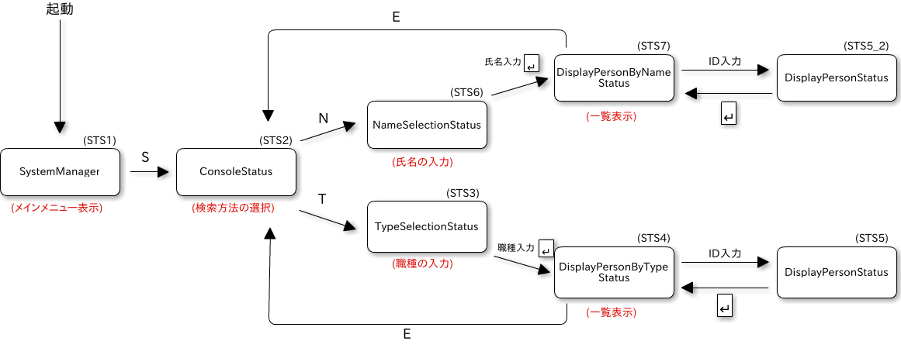

# 検索結果表示方法の変更

## 1.概要
従業員情報を検索して出力する結果一覧を３件ずつ表示するように変更する．  
現仕様では従業員情報を検索する機能において「氏名から検索」と「職種から検索」  
の二つの機能があり、氏名または職種から検索すると、該当の全従業員の情報が一度に  
多数の従業員が画面に表示されて情報を確認しづらくなる．そこで、氏名または職種で  
従業員情報を検索して出力する結果一覧を３件ずつ表示するように変更する．

## 2.ユースケース図

## 3.イベントフロー
1. 「氏名から検索」の機能コードが選択された場合は、システムは入力された文字列を含む  
従業員情報を検索し、最初の３件（１件目～３件目）を表示する．オペレータが検索結果一覧  
より機能コードまたは従業員IDを入力すると、入力された内容によって下記３～６の処理に  
分かれる．なお、検索した件数が３件に満たない場合も検索結果を表示すること．  
2. 「職種から検索」の機能コードが選択された場合は、システムは入力された職種の従業員情報  
を検索し、最初の３件（１件目～３件目）を表示する．オペレータが検索結果一覧より機能コードまたは  
IDを入力すると、入力された内容によって下記３～６の処理に分かれる．なお、検索した結果が３件  
に満たない場合も検索結果を表示すること．
3. 「検索結果一覧終了」の一覧終了コードが選択された場合は、検索方法の選択画面に戻る．  
4. 「従業員ID」が入力された場合は、１または２で検索した全ての従業員情報から、該当する従業員の  
詳細情報を表示する．  
※全４件検索された場合、非表示の１件も詳細情報の表示対象とする．  
5. 「前の３件」の機能コードが選択された場合は、以下のようにする．  
	1. 現在表示している３件より前の３件を表示する．
	2. 前の件数がない場合は、末尾から３件を表示する．また、前の件数が３件に満たない場合も、  
	末尾から３件を表示する．  
	※全２件の場合、２件表示．全５件で３～５件目を表示している場合、１～２件目  
	を表示せずに末尾の３件を表示する．  
6. 「次の３件」の機能コードが選択された場合は、以下のようにする．  
	1. 現在表示している３件より次の３件を表示する．  
	なお、次の件数が３件に満たない場合は、残りの件数分だけ表示する．  
	2. 次の件数がない場合は、先頭から３件を表示する．  
	※全２件の場合、２件表示．全４件で４件目を表示している場合、先頭に  
	戻り、先頭の３件を表示する．  

## 4.シーケンス図

### 4.1 「従業員情報を検索する」のシーケンス図

#### 4.1.1 「氏名から検索」のコードが選択された場合

#### 4.1.2 「職種から検索」のコードが選択された場合

## 5.クラス図

### 5.1. クラスの概要
|クラス名|概要|  
|:-------|:---|  
|SystemManager|従業員派遣管理メインクラス|  
|ConsoleStatus|システムの状態を表す．また、ユーザとのやりとりやデータの入出力を行う|  
|NameSelectionStatus|検索する名前を入力する画面|  
|DisplayPersonByNameStatus|検索結果を一覧表示する画面|  
|DisplayPersonStatus|詳細情報を表示する画面|  
|TypeSelectionStatus|検索する職種を入力する画面|  
|DisplayPersonByTypeStatus|検索結果を一覧表示する画面|  

### 5.2. システムのクラス図

## 6.メソッド一覧

### 6.1 クラス SystemManager
|NO.|メソッド名|処理名|  
|:-:|:---------|:-----|  
|1|main|メインメソッド|  
|2|statusSetting|  

### 6.2 クラス ConsoleStatus
|NO.|メソッド名|処理名|  
|:-:|:---------|:-----|  

### 6.3 クラス NameSelectionStatus
|NO.|メソッド名|処理名|  
|:-:|:---------|:-----|  

### 6.4 クラス TypeSelectionStatus
|NO.|メソッド名|処理名|  
|:-:|:---------|:-----|  

### 6.5 クラス DisplayPersonByNameStatus
|NO.|メソッド名|処理名|  
|:-:|:---------|:-----|  

### 6.6 クラス DisplayPersonByTypeStatus
|NO.|メソッド名|処理名|  
|:-:|:---------|:-----|  

## 7. ファイル
検索からは従業員マスタ(person.csv)から検索
- 従業員マスタ(person.csv)
	- 従業員ID
	- 氏名
	- 住所
	- 電話番号
	- 職種
	- 勤続年数
	- 単価
	- 削除フラグ

## 8. システムの状態遷移図

## 9. 画面イメージ

### 9.1 最初の３件の表示画面

### 9.2 Nキーで次の３件
#### 9.2.1 次の３件を表示した画面

#### 9.2.2 次の３件がない場合に先頭から３件を表示した画面

### 9.3 Pキーで前の３件
#### 9.3.1 前の３件を表示した画面

#### 9.3.2 前の３件がない場合に末尾の３件を表示した画面
